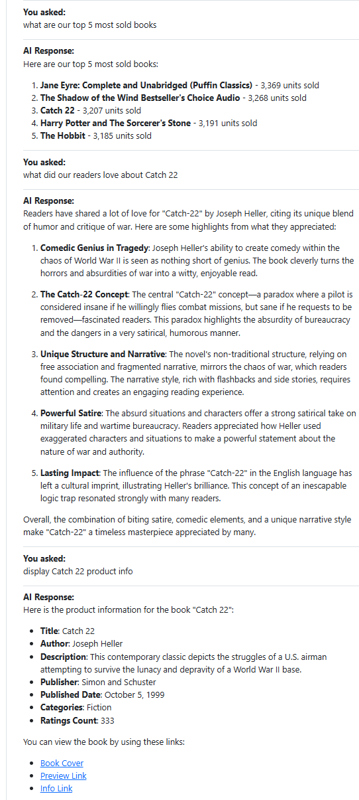

# Books store AI Agent RAG chat

This project demonstrates how you can build an agentic AI RAG
for an on online book store.

It uses *Pydantic-Ai* agents with *OpenAI GPT-4o*, *Milvus (Zilliz)* for vector search, and *SQLite* for structured book sales data. 
Agents intelligently route queries to the right tools based on context.

Agent Tools:

* web_search: Perform Google-style keyword searches using a Serper API integration.

*  search_the_internet: Scrape and read content from URLs. It returns clean, human-readable page content.

* reviews_vector_database: Retrieve book reviews from [a Amazon book reviews dataset](https://www.kaggle.com/datasets/mohamedbakhet/amazon-books-reviews). These reviews are stored in a vector database (*Zilliz*) and embedded using OpenAI embeddings.
Reviews include user opinions, summaries, themes, and direct quotes.

* call_sql_database_agent: Query a SQL database containing information about books, pricing, stock, and sales data.
Powered by an internal agent that knows how to construct and run SQL queries against SQLite.
 



## Running the project

### Requirements

You need to have *Python 3.10+* installed on your system to install the neccessary packages.

```
python -m venv venv
source venv/bin/activate

pip install -r requirements.txt
```


### API KEYS

For the project to work you need the following API keys:
* Open AI API key https://platform.openai.com/api-keys
* Serper Dev API key for web search https://serper.dev/
* Zilliz cloud account for RAG, create a cluster and get its acccess token https://zilliz.com/ 

Set the variables into an `.env` file in the `/app` directory

```bash
OPENAI_API_KEY=...
SERPER_API_KEY=...
ZILLIZ_CLUSTER_ENDPOINT=...
ZILLIZ_TOKEN=...
```

### Creating the ZILLIZ cluster of book reviews

follow the underlying steps (first two optional if you use the subset of data found under `app/book_reviews`)

Download the Amazon book reviews dataset from
https://www.kaggle.com/datasets/mohamedbakhet/amazon-books-reviews?resource=download 

The dataset is practically a smaller subset of a larger Amazon products dataset. You can access it at
https://amazon-reviews-2023.github.io/ 
 
```
#1. unpack the dataset .csv files under /app/book_reviews
unzip archive.zip -d ./app/book_reviews

#2. select a smaller subset of top books for indexing (feel free to increase the number of reviews/books)
python reviews_preprocess.py

#3. create a zilliz vector store collection on the reviews
python reviews_create_collection.py

#4. ask a question on the dataset to check that everything is working correctly
python reviews_analyze.py "How do readers feel about 1984?"

#5. After that create fake sales data to be queried by the sql agent
python reviews_fake_sql_sales.py
```


### Running the app

Then Run the agent with
```
uvicorn app.chat_app_backend:app --reload
```

Then you can view the ai agent chat at http://localhost:8000/ 

Openapi documentation is also available at http://localhost:8000/docs 


# Misc

Info on techology choices:
* https://simmering.dev/blog/pydantic-ai/
* https://www.reddit.com/r/LangChain/comments/1ji4d2k/langgraph_vs_pydantic_ai/ 
* https://datasystemreviews.com/best-open-source-vector-databases.html


Docs:
* https://ai.pydantic.dev/ 
* Milvus/zilliz:
* * https://milvus.io/docs/quickstart.md 
* * https://docs.zilliz.com/docs/quick-start

# TODOs

The created mock database from the reviews makes for a fun demo of how to prompt sql via an llm, but its
structure does not allow for much query complexity. You might have to scrape you own dataset to get
a better demo. Related to it, here are some problems to solve:
* Books with slight title differences (e.g., "Of Mice and Men" vs. "Of Mice & Men") are treated as separate entities.
* Add fields like format, language, or edition to simulate a more realistic product catalog and enable richer queries.
* Categories are currently stored as comma-separated strings, making them hard to filter or aggregate. 
* give more context to sql tables, attach examples of return table rows.

Also, there is some validation for prompt injection, but you might want to try If you can get the LLM to execute some other operations than `SELECT` on the
database, for example, modify it.
